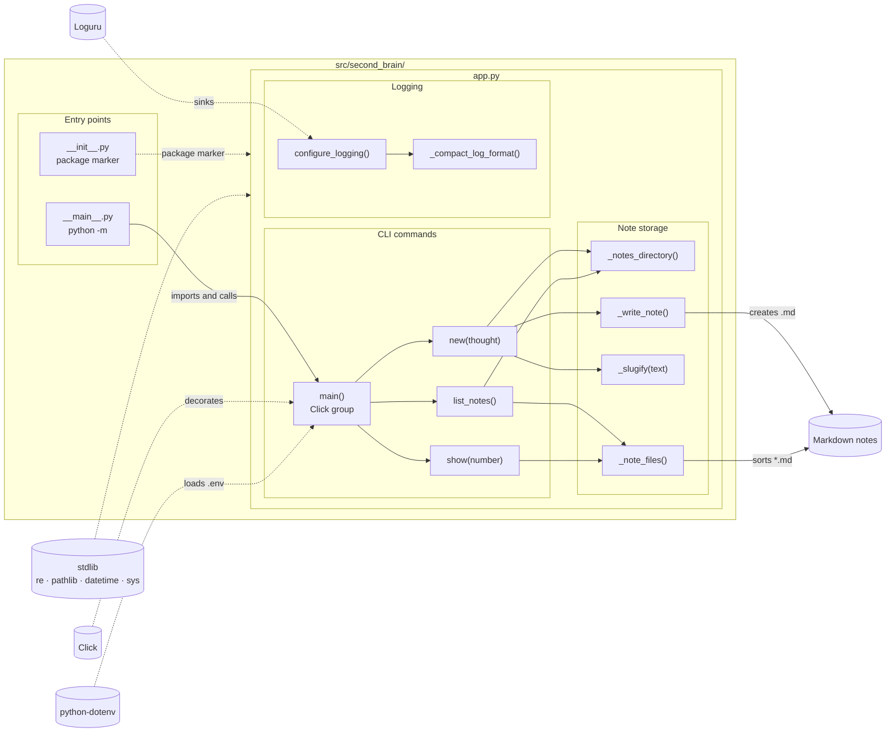
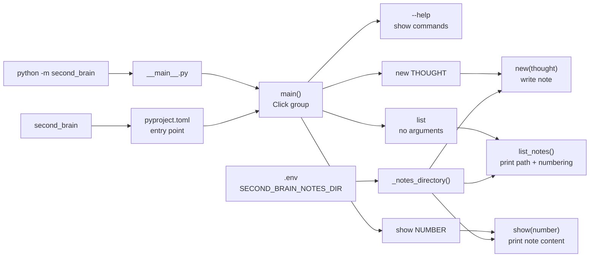

# Application Flowcharts

These diagrams show how the package is connected, how its entry points route
arguments, and how a user moves from an idea to a saved Markdown note.

## Documentation filename rule

All authored pages in `docs/` use the pattern `[TYPE]-###-slug.md`, where
`TYPE` identifies the page's purpose, `###` is its sequence number, and `slug`
is a short lowercase description. For example, this page is
`ARCH-001-app-flowcharts.md`. The reserved `index.md` file is the MkDocs home
page and is the only navigation entry-point exception.

## 1. Package overview

## 2. Entry points and arguments

## 3. Example user flow

```mermaid
flowchart LR
    Thought["💭 thought"] --> NewCmd["new<br/>&quot;My idea&quot;"]
    NewCmd --> LoadEnv["Load .env<br/>resolve notes directory"]
    LoadEnv --> Create["timestamped .md file<br/>plain Markdown"]
    Create --> Saved[("~/second_brain/<br/>note.md")]

    Saved --> ListCmd["second_brain list"]
    ListCmd --> Index["Print full path<br/>1. note.md"]
    Index --> Choice["User chooses NUMBER"]
    Choice --> ShowCmd["second_brain show 1"]
    ShowCmd --> Read["Read UTF-8 Markdown<br/>from the same sorted list"]
    Read --> Terminal["Print note content<br/>to the terminal"]
```

